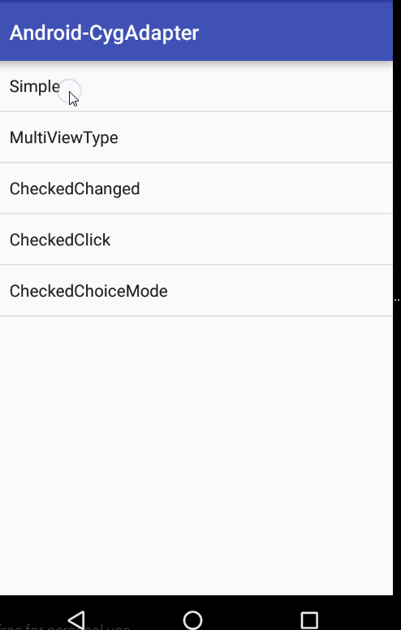

# CygAdapter
基于`BaseAdapter`封闭通用适配器，支持`ListView`、`GridView`，只需要简单几行代码搞定复杂的业务逻辑。
- 支持多视图
- 解决`CompoundButton`滑动错乱
- 数据排序
- 数据过滤

# 增删改

```java
add(T object)
addAll(List<T> collection)
insert(T object, int index)
set(T object)
set(T object, int index)
remove(T object)
remove(int location)
clear(boolean notify)//清除数据，notify true 通知刷新
setCurrentCheckPosition(int position)//设置当前点击行
List<T> getObjects()//取出所有数据
```

#引用

```javascript
compile 'com.mylhyl:cygadapter:1.1.1'
```

[下载jar](preview)

#效果图


#使用
#### 1.简单的[CygAdapter](cygadapter/src/main/java/com/mylhyl/cygadapter/CygAdapter.java)

```java
mAdapter = new CygAdapter<Student>(getContext(), android.R.layout.simple_list_item_1, datas) {
    @Override
    public void onBindData(CygViewHolder viewHolder, Student item, int position) {
        TextView tv = viewHolder.findViewById(android.R.id.text1);
        tv.setText(item.naem + "：" + item.age + "岁");
        if (position == getCurrentCheckPosition()) {
            tv.setBackgroundColor(Color.RED);
        } else {
            tv.setBackgroundColor(Color.WHITE);
        }
    }
};
setListAdapter(mAdapter);
```
#### 2.多视图[CygMultiViewTypeAdapter](cygadapter/src/main/java/com/mylhyl/cygadapter/CygMultiViewTypeAdapter.java)
 - 内部已定义`SparseIntArray`变量，用于存储视图数据`<k,v> = <viewType,layoutId>`
 - 构造函数中`CygMultiViewTypeAdapter(Context context, List objects, SparseIntArray itemViewTypes)`传入视图数据`SparseIntArray`
 - 也可以用提供的`addItemViewType(viewType,layoutId)`方法来装入视图数据`<viewType,layoutId>`
 - 主要是`getItemViewType`方法，根据情况返回相应的viewType，用法与`BaseAdapter getItemViewType(int position)`一样

```java
public class ChatAdapter extends CygMultiViewTypeAdapter<ChatMsg> {
    private static final int VIEW_TYPE_TO_TEXT = 0;
    private static final int VIEW_TYPE_FROM_TEXT = 1;
    private static final int VIEW_TYPE_TO_IMAGE = 2;
    private static final int VIEW_TYPE_FROM_IMAGE = 3;

    public ChatAdapter(Context context, List objects) {
        super(context, objects, null);
        addItemViewType(VIEW_TYPE_TO_TEXT, R.layout.fragment_multi_view_type_to_item_text);
        addItemViewType(VIEW_TYPE_FROM_TEXT, R.layout.fragment_multi_view_type_from_item_text);
        addItemViewType(VIEW_TYPE_TO_IMAGE, R.layout.fragment_multi_view_type_to_item_image);
        addItemViewType(VIEW_TYPE_FROM_IMAGE, R.layout.fragment_multi_view_type_from_item_image);
    }

    @Override
    public int getItemViewType(ChatMsg item, int position) {
        if (item.isTo) {
            if (item.msgType == ChatMsg.MsgType.TEXT) return VIEW_TYPE_TO_TEXT;
            else return VIEW_TYPE_TO_IMAGE;
        } else {
            if (item.msgType == ChatMsg.MsgType.TEXT) return VIEW_TYPE_FROM_TEXT;
            else return VIEW_TYPE_FROM_IMAGE;
        }
    }

    @Override
    public void onBindData(CygViewHolder viewHolder, ChatMsg item, int position, int viewType) {
        if (viewType == VIEW_TYPE_FROM_TEXT || viewType == VIEW_TYPE_TO_TEXT) {
            viewHolder.setText(R.id.textView, item.msgContent);
        } else if (viewType == VIEW_TYPE_FROM_IMAGE || viewType == VIEW_TYPE_TO_IMAGE) {
            ImageView imageView = viewHolder.findViewById(R.id.imageView1);
            imageView.setImageResource(item.msgImage);
        }
    }
}
```

#### 3.带`CompoundButton`视图的[CygCheckedAdapter](cygadapter/src/main/java/com/mylhyl/cygadapter/CygCheckedAdapter.java)
内部已解决滑动错乱的问题，需要在构造方法传入`CompoundButton`的id

```java
mAdapter = new CygCheckedAdapter<String>(getContext(),
        R.layout.fragment_checked_changed_item,R.id.checkBox, datas) {

    @Override
    public void onBindData(CygViewHolder viewHolder, String item, final int position) {
        viewHolder.setText(android.R.id.text1, item);
    }
};
setListAdapter(mAdapter);
```

那么在`ListView`的单击事件中如何改变`CompoundButton`的状态呢？好办提供了`toggleCheckObject(view, position)`方法

```java
@Override
public void onListItemClick(ListView listView, View view, int position, long id) {
    mAdapter.toggleCheckObject(view, position);
}
```

#### 4.带`EditText`视图的[CygEditAdapter](cygadapter/src/main/java/com/mylhyl/cygadapter/CygEditAdapter.java)
内部已解决滑动错乱的问题，需要在构造方法传入`EditText`的id

```java
        mAdapter = new CygEditAdapter<Student>(getContext(), R.layout.fragment_input_item, R.id.editText, datas) {


            @Override
            public void onBindTextChanged(Student item, String text) {
                item.name = text;
            }

            @Override
            public void onBindData(CygViewHolder viewHolder, Student item, int position) {
                EditText editText = viewHolder.findViewById(R.id.editText);
                editText.setText(item.name);
            }
        };
```

# 感谢
[baseAdapter](https://github.com/hongyangAndroid/baseAdapter)

